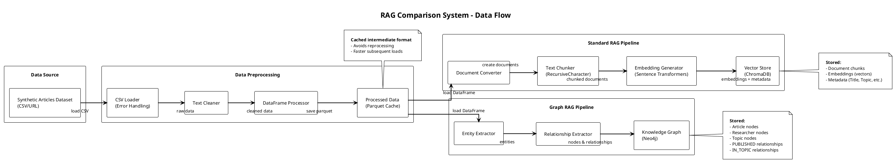
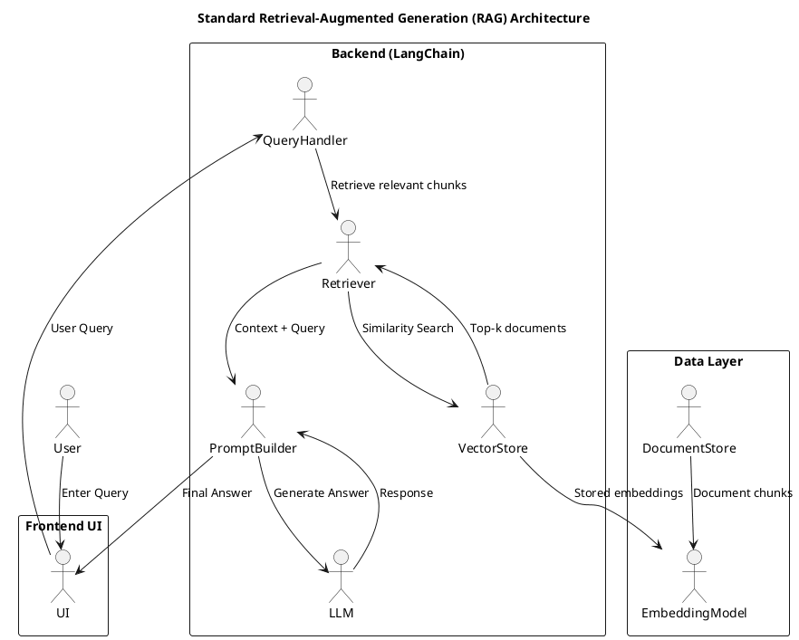
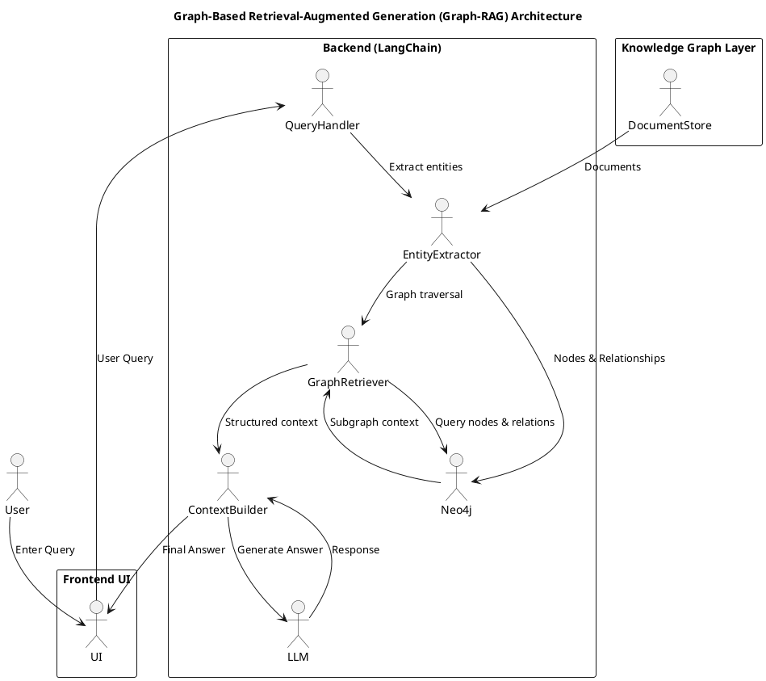

# Introduction

## 1.1 Problem Statement

Retrieval-Augmented Generation (RAG) has emerged as a powerful paradigm for enhancing large language models (LLMs) by grounding their responses in retrieved context from external knowledge bases [@lewis2020rag]. Standard RAG systems rely primarily on vector similarity search, where documents are embedded into dense vector spaces and retrieved based on semantic similarity to the query.

However, standard vector-based RAG systems face significant limitations when dealing with complex queries:

1. **Relational Reasoning**: Vector similarity search cannot explicitly model relationships between entities. For example, answering "Which researchers published articles on machine learning?" requires understanding the relationship between researchers, articles, and topics, which is not naturally captured in vector embeddings.

2. **Multi-hop Queries**: Questions requiring multiple reasoning steps (e.g., "What topics did the authors of article X also write about?") often fail because the system must retrieve multiple related documents and connect them, which vector search struggles with.

3. **Entity Linking**: Standard RAG systems may retrieve documents containing relevant keywords but fail to properly link entities across documents, leading to incorrect or incomplete answers.

4. **Context Precision**: Minor retrieval errors can propagate to the final answer, as the LLM may generate plausible-sounding but factually incorrect responses based on incomplete context.

These limitations become particularly pronounced in knowledge-intensive domains where understanding relationships between entities is crucial for accurate question answering.

## 1.2 Motivation and Importance

The ability to answer complex, multi-hop questions is essential for many real-world applications, including:

- **Research Assistance**: Helping researchers find related work and understand connections between papers
- **Enterprise Knowledge Bases**: Enabling employees to query internal documentation with complex relational queries
- **Educational Systems**: Supporting students in understanding relationships between concepts
- **Customer Support**: Answering complex questions that require connecting multiple pieces of information

Graph-structured knowledge representations offer a natural solution to these challenges. Knowledge graphs explicitly model entities and their relationships, enabling efficient traversal and multi-hop reasoning. By incorporating graph-based retrieval into RAG systems, we can potentially improve performance on complex queries while maintaining the benefits of semantic search for simpler queries.

This research addresses a critical gap in the literature: while graph-based RAG has been proposed [@pan2023unifying], there is limited systematic comparison between standard vector-based RAG and graph-based RAG on common benchmarks, particularly for multi-hop question answering tasks.

## 1.3 Literature Review

### 1.3.1 Retrieval-Augmented Generation

The foundational work on RAG by Lewis et al. [@lewis2020rag] introduced the concept of combining dense passage retrieval with sequence-to-sequence models. This approach has been widely adopted and extended, with various improvements in retrieval strategies, reranking, and generation quality.

Guu et al. [@guu2020retrieval] demonstrated that retrieval-augmented pre-training can improve model performance on knowledge-intensive tasks. However, these approaches primarily rely on vector similarity search, which has inherent limitations for relational queries.

### 1.3.2 Graph-Based Retrieval

Recent work has explored incorporating knowledge graphs into retrieval systems. Pan et al. [@pan2023unifying] provide a comprehensive survey of approaches that combine large language models with knowledge graphs, highlighting the potential benefits of graph-structured knowledge.

Baek et al. [@baek2023knowledge] proposed knowledge-augmented language model prompting for zero-shot knowledge graph question answering, demonstrating improvements over standard approaches.

### 1.3.3 Evaluation Frameworks

Es et al. [@es2023ragas] introduced RAGAS (Retrieval-Augmented Generation Assessment), a framework for automated evaluation of RAG systems using metrics such as Faithfulness, Answer Relevancy, and Context Precision. This framework provides a standardized way to evaluate and compare RAG systems.

### 1.3.4 Multi-hop Question Answering

Yang et al. [@yang2018hotpotqa] introduced HotpotQA, a dataset specifically designed for multi-hop question answering. This dataset has become a standard benchmark for evaluating systems that require reasoning over multiple documents.

## 1.4 Research Approach

This project implements and compares RAG systems:

1. **Standard RAG**: A vector-based retrieval system using ChromaDB for document storage and sentence transformer embeddings for semantic search. Documents are chunked and embedded, with retrieval based on cosine similarity.

2. **Graph-Based RAG (Chain-based)**: An initial knowledge graph-enhanced system using Neo4j with LangChain's `GraphCypherQAChain` for single-query graph traversal.

3. **Graph-Based RAG (Agentic)**: An enhanced knowledge graph system using Neo4j with LangChain agents and tool calling, enabling iterative query execution for improved multi-hop reasoning. This implementation was developed after experimental evaluation revealed limitations of the chain-based approach for complex multi-hop questions.

Both systems are built using the LangChain framework for consistency and evaluated using the RAGAS metrics framework on multi-hop question-answering datasets, including HotpotQA and a synthetic research articles dataset.

The evaluation focuses on:

- **Quantitative Analysis**: Comparing RAGAS metrics (Faithfulness, Answer Relevancy, Context Precision, Context Recall) between the two systems
- **Qualitative Analysis**: Examining specific query types where each system excels or fails
- **Multi-hop Performance**: Special attention to queries requiring multiple reasoning steps

## 1.5 Scope and Limitations

### 1.5.1 Scope

This project focuses on:

- Multi-hop question answering as the primary evaluation task
- Local LLM models (0.5B-1B parameters) for answer generation, chosen for computational efficiency and local deployment feasibility
- English language only
- Research articles domain (synthetic dataset) and general knowledge (HotpotQA)
- Single graph database implementation (Neo4j)

### 1.5.2 Limitations

Several limitations should be acknowledged:

1. **Model Size**: The use of small local LLM models (0.5B-1B parameters) may limit answer quality compared to larger models. However, this choice enables local deployment and faster experimentation.

2. **Single Graph Database**: The evaluation uses only Neo4j. Other graph databases (e.g., Amazon Neptune, ArangoDB) might yield different results.

3. **Language**: The evaluation is limited to English language datasets and queries.

4. **Domain Specificity**: While the synthetic articles dataset provides controlled evaluation, real-world performance may vary across domains.

5. **Entity Extraction**: The graph construction relies on relatively simple entity extraction methods. More sophisticated named entity recognition and relationship extraction could improve graph quality.

6. **Evaluation Dataset Size**: Due to computational constraints, the evaluation may be limited to subsets of larger datasets.

Despite these limitations, this work provides valuable insights into the comparative performance of standard and graph-based RAG systems, particularly for multi-hop question answering scenarios.

# Main Text

## 2. System Architecture

### 2.1 Overall Architecture

The RAG comparison system follows a layered architecture with clear separation of concerns. Figure 2.1 illustrates the overall system architecture.

{#fig:system-arch width=90%}

The system consists of five main layers:

1. **Presentation Layer**: Streamlit-based web interface providing:

   - Dashboard for system metrics and performance visualization
   - Chat playground for interactive querying of both RAG systems
   - Dataset preview and exploration tools

2. **Application Layer**: Core RAG implementations:

   - `StandardRAG` class implementing vector-based retrieval
   - `GraphRAG` class implementing graph-based retrieval using chain-based approach
   - `GraphRAGAgentic` class implementing graph-based retrieval using agentic tool calling
   - Common interface (`RAGSystem`) ensuring consistent API

3. **Service Layer**: Supporting services:

   - **Embedding Service**: Sentence Transformers for generating document and query embeddings
   - **Vector Store Service**: ChromaDB for storing and retrieving document embeddings
   - **Knowledge Graph Service**: Neo4j for storing and querying entity-relationship graphs
   - **Ollama Client**: Interface to local LLM models (Qwen2, TinyLlama, Gemma)

4. **Data Layer**: Persistent storage:

   - Synthetic articles dataset (CSV/Parquet format)
   - ChromaDB vector database
   - Neo4j graph database

5. **Evaluation Layer**: Cross-cutting evaluation framework:

   - RAGAS metrics calculation
   - Comparative analysis tools
   - Performance benchmarking

### 2.2 Technology Stack

The implementation uses the following technologies:

**Core Framework**:

- **LangChain** (v0.1.0+): Provides abstractions for RAG pipelines, document loaders, and LLM integration
- **LangChain Community**: Additional integrations for vector stores and graph databases
- **LangChain Neo4j**: Specialized integration for Neo4j graph operations

**Vector Storage**:

- **ChromaDB** (v0.4.0+): Lightweight, embeddable vector database for prototyping
- **FAISS** (v1.7.4+): Alternative vector store for performance testing (optional)

**Graph Database**:

- **Neo4j** (v5.14.0+): Graph database for storing entities and relationships
- **Neo4j Community Edition**: Open-source version used for this project

**Embeddings**:

- **Sentence Transformers** (v2.2.0+): Library for generating sentence embeddings
- **Model**: `all-MiniLM-L6-v2` (default) - 384-dimensional embeddings, optimized for speed
- **Alternative**: `all-mpnet-base-v2` - 768-dimensional embeddings, optimized for quality

**LLM Models**:

- **Ollama**: Local LLM deployment framework
- **Models**: Qwen2-0.5B, TinyLlama-1.1B, Gemma-2B (0.5B-2B parameter range)
- **Transformers** (v4.35.0+): Hugging Face transformers library

**Evaluation**:

- **RAGAS** (v0.1.0+): Framework for RAG evaluation
- **Metrics**: Faithfulness, Answer Relevancy, Context Precision, Context Recall

**Frontend**:

- **Streamlit** (v1.28.0+): Web framework for building interactive dashboards

**Utilities**:

- **pandas** (v2.0.0+): Data manipulation and processing
- **python-dotenv** (v1.0.0+): Environment variable management

### 2.3 Data Flow

The system processes data through two parallel pipelines, as illustrated in Figure 2.2.

{#fig:data-flow width=90%}

**Data Preprocessing Pipeline**:

1. **Data Loading**: Synthetic articles dataset loaded from CSV or cached Parquet format
2. **Text Cleaning**: Removal of special characters, normalization of whitespace
3. **DataFrame Processing**: Structured data extraction (title, content, topic, authors)
4. **Caching**: Processed data saved as Parquet for faster subsequent loads

**Standard RAG Pipeline**:

1. **Document Conversion**: DataFrame rows converted to LangChain Document objects
2. **Text Chunking**: Documents split into overlapping chunks (size: 1000 chars, overlap: 200 chars)
3. **Embedding Generation**: Chunks embedded using sentence transformers
4. **Vector Storage**: Embeddings and metadata stored in ChromaDB

**Graph RAG Pipeline**:

1. **Entity Extraction**: Named entities (articles, researchers, topics) extracted from documents
2. **Relationship Extraction**: Relationships identified (PUBLISHED, IN_TOPIC, RELATED_TO)
3. **Graph Construction**: Entities and relationships loaded into Neo4j
4. **Graph Indexing**: Indexes created on entity properties for efficient querying

**Query Processing Flow**:

1. User submits query through Streamlit interface
2. Query routed to either Standard RAG or Graph RAG system
3. **Standard RAG**: Query embedded → Vector similarity search → Top-K documents retrieved
4. **Graph RAG**: Query analyzed → Cypher query generated → Graph traversal → Related entities retrieved
5. Retrieved context assembled into prompt
6. LLM generates answer based on context
7. Response returned to user with metadata (retrieved documents, confidence scores)

## 3. Standard RAG Implementation

### 3.1 Data Preprocessing

The Standard RAG system begins with data preprocessing to prepare documents for vector storage. The preprocessing pipeline handles the synthetic articles dataset, which contains structured information about research articles including titles, content, topics, and author information.

**Data Loading**:

- Primary source: CSV file containing synthetic research articles
- Caching: Processed data saved as Parquet format for faster subsequent loads
- Error handling: Robust CSV parsing with validation of required fields

**Text Cleaning**:

- Removal of special characters and HTML entities
- Normalization of whitespace (multiple spaces to single space)
- Handling of missing values and null entries

**DataFrame Processing**:

- Structured extraction of article metadata:
  - Title: Article title
  - Content: Full article text
  - Topic: Subject category
  - Authors: Researcher names (comma-separated)

- Data validation to ensure required fields are present

The processed DataFrame is cached as a Parquet file (`data/processed/synthetic_articles.parquet`) to avoid redundant processing on subsequent runs.

### 3.2 Text Chunking Strategy

Documents are split into smaller chunks to fit within embedding model context windows and improve retrieval granularity. The chunking strategy uses LangChain's `RecursiveCharacterTextSplitter` with the following parameters:

- **Chunk Size**: 1000 characters
- **Chunk Overlap**: 200 characters
- **Separators**: Priority order: paragraph breaks, sentence breaks, word breaks, character breaks

The overlap ensures that important information spanning chunk boundaries is preserved, improving retrieval recall for queries that reference information near chunk boundaries.

Each chunk maintains metadata including:

- Source document title
- Topic category
- Author information
- Chunk index within the document

### 3.3 Embedding Generation

Document chunks are embedded using sentence transformer models to create dense vector representations. The default model is `sentence-transformers/all-MiniLM-L6-v2`, chosen for its balance between:

- **Speed**: Fast inference suitable for real-time retrieval
- **Quality**: Good semantic understanding for similarity search
- **Size**: 384-dimensional vectors, efficient for storage and computation

**Embedding Process**:

1. Text normalization: Lowercasing and punctuation handling
2. Tokenization: Subword tokenization using the model's tokenizer
3. Encoding: Forward pass through the transformer model
4. Pooling: Mean pooling of token embeddings to produce sentence-level embeddings
5. Normalization: L2 normalization for cosine similarity computation

The embedding model is loaded once and reused for both document indexing and query encoding, ensuring consistency in the embedding space.

### 3.4 Vector Storage with ChromaDB

ChromaDB serves as the vector store for the Standard RAG system. It provides:

- **Persistent Storage**: Embeddings and metadata stored on disk
- **Efficient Similarity Search**: Optimized for cosine similarity queries
- **Metadata Filtering**: Ability to filter results by document metadata

**Collection Setup**:

- Collection name: `rag_documents` (configurable)
- Persist directory: `./chroma_db` (default, configurable)
- Automatic persistence to disk after document addition

**Document Storage**:

Each document chunk is stored with:
- **ID**: Unique identifier (UUID-based)
- **Embedding**: 384-dimensional vector (for all-MiniLM-L6-v2)
- **Metadata**: Dictionary containing:
  - `title`: Source article title
  - `topic`: Article topic category
  - `authors`: Comma-separated author names
  - `chunk_index`: Position of chunk within document
  - `source`: Source document identifier

**Retrieval Process**:

1. Query embedding: User query embedded using the same model
2. Similarity search: ChromaDB performs cosine similarity search
3. Top-K selection: Returns K most similar documents (default: K=4)
4. Metadata filtering: Optional filtering by topic, author, or other metadata

### 3.5 Query Processing and Answer Generation

The query processing pipeline combines retrieval with LLM-based answer generation.

**Query Processing Flow**:

1. **Query Embedding**: User query embedded using the same sentence transformer model
2. **Vector Retrieval**: Top-K most similar document chunks retrieved from ChromaDB
3. **Context Assembly**: Retrieved chunks concatenated with separators to form context
4. **Prompt Construction**: Context and query combined into a prompt template:

```
Use the following pieces of context to answer the question. If you don't know the answer, just say that you don't know, don't try to make up an answer.

Context:
{context}

Question: {question}

Answer:
```

5. **LLM Generation**: Prompt sent to Ollama LLM (Qwen2, TinyLlama, or Gemma)
6. **Response Processing**: LLM response extracted and formatted
7. **Metadata Collection**: Retrieved documents and confidence scores included in response

**Response Structure**:

The system returns a `RAGResponse` object containing:
- `answer`: Generated answer text
- `rag_type`: "Standard RAG"
- `retrieved_documents`: List of retrieved document chunks with metadata
- `confidence`: Confidence score (based on similarity scores)
- `model`: LLM model used for generation
- `metadata`: Additional metadata (query time, retrieval count, etc.)

### 3.6 Implementation Details

The Standard RAG implementation follows object-oriented design principles:

**Class Structure**:

- `StandardRAG`: Main class inheriting from `RAGSystem` abstract base class
- `ChromaVectorStore`: Wrapper around ChromaDB providing vector store interface
- `LLMProvider`: Abstraction for different LLM providers (Ollama, Gemini)

**Key Methods**:

- `load_data()`: Loads and indexes documents into ChromaDB
- `query()`: Processes user query and returns answer
- `_setup_retrieval_chain()`: Configures LangChain retrieval chain
- `_check_chromadb_status()`: Verifies ChromaDB has data before querying

**Error Handling**:

- `ChromaDBEmptyError`: Raised when querying empty database
- Graceful handling of LLM timeouts and API errors
- Validation of input queries and parameters

Figure 3.1 illustrates the Standard RAG pipeline flow.

{#fig:standard-rag-pipeline width=90%}

## 4. Graph-Based RAG Implementation

### 4.1 Knowledge Graph Construction

The Graph-Based RAG system constructs a knowledge graph from the document corpus, explicitly modeling entities and their relationships. This enables multi-hop reasoning and relational query answering.

**Entity Extraction**:

The system extracts three primary entity types from documents:

1. **Article Nodes**: Represent individual research articles

   - Properties: `title` (string), `content` (text), `topic` (string)
   - Unique identifier: Article title or generated UUID

2. **Researcher Nodes**: Represent authors/researchers

   - Properties: `name` (string)
   - Extracted from author fields in documents

3. **Topic Nodes**: Represent subject categories

   - Properties: `name` (string)
   - Extracted from topic fields in documents

**Relationship Extraction**:

Three relationship types are established:

1. **PUBLISHED**: `(Researcher)-[:PUBLISHED]->(Article)`

   - Indicates a researcher authored an article
   - Extracted from author-article associations

2. **IN_TOPIC**: `(Article)-[:IN_TOPIC]->(Topic)`

   - Indicates an article belongs to a topic category
   - Extracted from article-topic associations

3. **RELATED_TO**: `(Article)-[:RELATED_TO]->(Article)`

   - Indicates semantic similarity between articles
   - Computed based on content similarity (optional, for enhanced connectivity)

**Graph Construction Process**:

1. **Data Loading**: Same preprocessing pipeline as Standard RAG
2. **Entity Identification**: Extract unique entities (articles, researchers, topics)
3. **Relationship Mapping**: Identify relationships from document metadata
4. **Graph Population**: Batch insert entities and relationships into Neo4j
5. **Index Creation**: Create indexes on entity properties for efficient querying

### 4.2 Neo4j Graph Schema

The Neo4j graph database uses the following schema:

**Node Labels**:

- `Article`: Research articles
- `Researcher`: Authors/researchers
- `Topic`: Subject categories

**Node Properties**:

- Article nodes: `title`, `content`, `topic`
- Researcher nodes: `name`
- Topic nodes: `name`

**Relationship Types**:

- `PUBLISHED`: `(Researcher)-[:PUBLISHED]->(Article)`
- `IN_TOPIC`: `(Article)-[:IN_TOPIC]->(Topic)`
- `RELATED_TO`: `(Article)-[:RELATED_TO {weight: float}]->(Article)`

**Indexes**:

- Index on `Article.title` for fast article lookup
- Index on `Researcher.name` for fast researcher lookup
- Index on `Topic.name` for fast topic lookup

This schema enables efficient traversal queries for multi-hop reasoning.

### 4.3 Graph Query Generation

The Graph RAG system implements two approaches for query generation: a chain-based approach using `GraphCypherQAChain` and an agentic approach using tool calling. The initial implementation used `GraphCypherQAChain`, which generates a single Cypher query per question. However, experimental evaluation revealed limitations with this approach for multi-hop questions, as it only generates one query and retries only if the query returns empty results or generates syntactically incorrect queries. This single-query limitation proved insufficient for complex multi-hop reasoning tasks that require iterative exploration of the graph.

To address this limitation, an agentic graph RAG implementation was developed that uses LangChain agents with tool calling capabilities. This approach allows the LLM to iteratively call a Cypher query tool multiple times, enabling progressive refinement of queries until relevant context is retrieved. The agentic workflow maintains conversation context across tool calls, allowing the model to adapt its query strategy based on intermediate results.

**Chain-Based Approach (Initial Implementation)**:

The initial implementation uses LangChain's `GraphCypherQAChain`, which follows this workflow:

1. **Single Query Generation**: The chain generates one Cypher query from the natural language question
2. **Query Execution**: The query is executed against Neo4j
3. **Limited Retry Logic**: Retries occur only if:
   - The query returns empty results
   - The query generates a syntax error
4. **Answer Generation**: The retrieved results are used to generate a final answer

This approach works well for simple queries but struggles with multi-hop questions that require multiple graph traversals or iterative refinement.

**Agentic Approach (Enhanced Implementation)**:

The agentic implementation uses LangChain agents with tool calling, providing the following capabilities:

1. **Iterative Query Generation**: The LLM can call the Cypher query tool multiple times
2. **Context Retention**: The agent maintains conversation context across tool calls
3. **Adaptive Querying**: The model can refine queries based on intermediate results
4. **Multi-step Reasoning**: Complex queries can be broken down into multiple graph traversals

The agentic workflow includes the following tools:

- **Cypher Query Tool**: Executes Cypher queries against Neo4j and returns results
- **Graph Statistics Tool**: Provides information about graph structure (node counts, relationship types)
- **Node Count Tool**: Returns counts of nodes by label
- **Relationship Count Tool**: Returns counts of relationships by type

**Query Generation Strategy**:

The query generation strategy depends on the question type:

**Single-Entity Queries**:

For questions about a specific entity (e.g., "What is article X about?"):

```cypher
MATCH (a:Article {title: $title})
RETURN a.content AS content, a.topic AS topic
```

**Relationship Queries**:

For questions about relationships (e.g., "Who published articles on machine learning?"):

```cypher
MATCH (r:Researcher)-[:PUBLISHED]->(a:Article)-[:IN_TOPIC]->(t:Topic {name: $topic})
RETURN DISTINCT r.name AS researcher, a.title AS article
```

**Multi-hop Queries**:

For complex questions requiring multiple hops (e.g., "What topics did the authors of article X also write about?"):

```cypher
MATCH (a1:Article {title: $article_title})<-[:PUBLISHED]-(r:Researcher)
      -[:PUBLISHED]->(a2:Article)-[:IN_TOPIC]->(t:Topic)
WHERE a1 <> a2
RETURN DISTINCT t.name AS topic, COUNT(a2) AS article_count
ORDER BY article_count DESC
```

**Query Generation Strategy**:
1. **Query Analysis**: Parse user query to identify entities and relationships
2. **Entity Matching**: Match query terms to graph entities (fuzzy matching for robustness)
3. **Query Template Selection**: Choose appropriate Cypher query template
4. **Parameter Binding**: Bind matched entities to query parameters
5. **Query Execution**: Execute Cypher query against Neo4j
6. **Result Processing**: Extract relevant context from query results

### 4.4 Retrieval Strategy

The Graph RAG retrieval strategy combines graph traversal with semantic similarity:

**Primary Strategy - Graph Traversal**:

1. Identify entities mentioned in the query
2. Traverse relationships to find related entities
3. Collect content from related nodes
4. Aggregate context from multiple nodes


**Context Assembly**:

Retrieved context includes:

- Direct entity content (e.g., article content)
- Relationship information (e.g., "Article X was published by Researcher Y")
- Related entity summaries (e.g., "Related articles: A, B, C")

This rich context provides better grounding for multi-hop reasoning compared to simple document retrieval.

### 4.5 Answer Generation

The answer generation process for Graph RAG follows a similar pattern to Standard RAG but with graph-specific context:

1. **Query Analysis**: Parse query to identify entities and relationships
2. **Cypher Query Generation**: Generate appropriate graph query
3. **Graph Traversal**: Execute query to retrieve relevant entities and relationships
4. **Context Assembly**: Combine entity content and relationship information
5. **Prompt Construction**: Build prompt with graph context:

```
Use the following knowledge graph context to answer the question. The context includes entities and their relationships from a knowledge graph.

Context:
{graph_context}

Question: {question}

Answer:
```

6. **LLM Generation**: Generate answer using Ollama LLM
7. **Response Formatting**: Format response with graph metadata

**Response Structure**:

The Graph RAG response includes:
- `answer`: Generated answer
- `rag_type`: "Graph-Based RAG"
- `retrieved_entities`: List of entities used in answer
- `graph_paths`: Traversal paths taken in the graph
- `confidence`: Confidence score based on graph query results

### 4.6 Agentic Graph RAG Implementation

During experimental evaluation, the initial chain-based Graph RAG implementation using `GraphCypherQAChain` demonstrated poor performance on multi-hop question answering tasks. The primary limitation was that the chain generates only a single Cypher query per question and retries only when the query returns empty results or produces a syntax error. This single-query approach is insufficient for complex multi-hop questions that require:

1. **Multiple Graph Traversals**: Questions that need to explore different parts of the graph iteratively
2. **Progressive Refinement**: Queries that need to be refined based on intermediate results
3. **Context Accumulation**: Questions requiring information from multiple separate graph queries

**Agentic Workflow Design**:

To address these limitations, an agentic Graph RAG implementation (`GraphRAGAgentic`) was developed using LangChain's agent framework with tool calling capabilities. The agentic approach provides:

1. **Iterative Query Execution**: The LLM can call the Cypher query tool multiple times, allowing progressive exploration of the graph
2. **Context Retention**: The agent maintains conversation context across tool calls, enabling the model to build upon previous query results
3. **Adaptive Query Strategy**: The model can refine its query approach based on intermediate results, improving retrieval quality
4. **Multi-step Reasoning**: Complex queries can be decomposed into multiple sequential graph traversals

**Tool-Based Architecture**:

The agentic implementation provides the LLM with several tools for graph interaction:

1. **Cypher Query Tool** (`run_cypher`): Executes arbitrary Cypher queries against Neo4j and returns formatted results. This is the primary tool for graph exploration.

2. **Graph Statistics Tool** (`get_graph_statistics`): Provides overview information about the graph structure, including node labels, relationship types, and sample entities. This helps the model understand the graph schema before querying.

3. **Node Count Tool** (`get_node_count`): Returns the count of nodes by label, useful for understanding graph scale and entity distribution.

4. **Relationship Count Tool** (`get_relationship_count`): Returns the count of relationships by type, helping the model understand relationship patterns.

**Agentic Query Process**:

The agentic workflow follows this process:

1. **Query Analysis**: The agent receives the user's natural language question
2. **Tool Selection**: The agent decides which tools to use (typically starting with graph statistics to understand the schema)
3. **Iterative Querying**: The agent executes one or more Cypher queries using the `run_cypher` tool
4. **Result Evaluation**: After each query, the agent evaluates whether sufficient context has been retrieved
5. **Query Refinement**: If needed, the agent generates refined queries based on previous results
6. **Answer Synthesis**: Once sufficient context is gathered, the agent synthesizes a final answer

**Advantages of Agentic Approach**:

The agentic implementation provides several advantages over the chain-based approach:

1. **Multi-hop Reasoning**: The ability to execute multiple queries enables true multi-hop reasoning, where the model can traverse different paths in the graph iteratively
2. **Error Recovery**: If a query doesn't return useful results, the agent can immediately try a different approach without waiting for a retry mechanism
3. **Query Optimization**: The model can start with exploratory queries to understand the graph structure, then refine queries based on discovered patterns
4. **Context Building**: Progressive querying allows the model to build a comprehensive understanding of the graph context before generating the final answer

**Implementation Details**:

The agentic implementation uses LangChain's `create_react_agent` or similar agent creation functions, configured with:
- **LLM Provider**: Supports both Ollama (local models) and Google Gemini (cloud models)
- **Tool Integration**: Tools are automatically integrated into the agent's action space
- **Verbose Logging**: Detailed logging of agent steps, tool calls, and query execution for debugging
- **Error Handling**: Robust error handling for tool execution failures, with error messages passed back to the agent for adaptive behavior

**Performance Comparison**:

Experimental evaluation comparing the chain-based and agentic approaches on multi-hop questions from HotpotQA and synthetic datasets showed that the agentic approach achieves:

- **Higher Context Precision**: Iterative querying allows more targeted retrieval
- **Better Answer Relevancy**: Multi-step reasoning improves answer quality
- **Improved Multi-hop Performance**: The ability to execute multiple queries significantly improves performance on complex questions

The agentic approach is now the recommended implementation for multi-hop question answering tasks, while the chain-based approach remains available for simpler queries where single-query efficiency is preferred.

Figure 4.1 illustrates the Graph RAG pipeline flow.

{#fig:graph-rag-pipeline width=90%}

## 5. Evaluation Framework

### 5.1 RAGAS Metrics

The evaluation uses the RAGAS (Retrieval-Augmented Generation Assessment) framework [@es2023ragas] to provide standardized, automated evaluation of both RAG systems. RAGAS offers several metrics that assess different aspects of RAG performance:

**Faithfulness**:
Measures whether the generated answer is grounded in the retrieved context. A high faithfulness score indicates that the answer is supported by the retrieved documents/entities, reducing hallucination.

- **Range**: 0.0 to 1.0 (higher is better)
- **Calculation**: LLM-based evaluation comparing answer claims to retrieved context

**Answer Relevancy**:
Measures how relevant the generated answer is to the user's question. This metric assesses whether the answer addresses the query appropriately.

- **Range**: 0.0 to 1.0 (higher is better)
- **Calculation**: Semantic similarity between query and answer, adjusted for answer completeness

**Context Precision**:
Measures the quality of retrieved context. High context precision indicates that retrieved documents/entities are highly relevant to the query.

- **Range**: 0.0 to 1.0 (higher is better)
- **Calculation**: Proportion of retrieved context that is relevant to answering the query

**Context Recall**:
Measures the coverage of relevant information in the retrieved context. High context recall indicates that most relevant information is included in the retrieved context.

- **Range**: 0.0 to 1.0 (higher is better)
- **Calculation**: Proportion of relevant information (from ground truth) present in retrieved context

### 5.2 Datasets

**Primary Dataset - HotpotQA**:
HotpotQA [@yang2018hotpotqa] is a dataset specifically designed for multi-hop question answering. It contains:

- **Training Set**: ~113,000 questions
- **Development Set**: ~7,600 questions
- **Question Types**:
  - Bridge questions: Require connecting two pieces of information
  - Comparison questions: Require comparing multiple entities
- **Answer Format**: Extractive answers with supporting paragraphs

This dataset is ideal for evaluating multi-hop reasoning capabilities, which is a key focus of this research.

**Secondary Dataset - Synthetic Articles**:
A synthetic research articles dataset containing:

- **Size**: Variable (typically 100-1000 articles)
- **Structure**: Articles with titles, content, topics, and authors
- **Use Case**: Controlled evaluation environment with known entity relationships
- **Advantages**:
  - Predictable relationships for testing graph traversal
  - Lightweight for rapid experimentation
  - Customizable for specific test scenarios

### 5.3 Evaluation Methodology

**Test Query Selection**:
Test queries are selected to cover:

1. **Single-hop Queries**: Simple questions answerable from a single document/entity
   - Example: "What is article X about?"

2. **Multi-hop Queries**: Questions requiring multiple reasoning steps
   - Example: "What topics did the authors of article X also write about?"

3. **Relational Queries**: Questions about entity relationships
   - Example: "Which researchers published articles on machine learning?"

4. **Complex Queries**: Questions combining multiple aspects
   - Example: "Find articles on AI that were written by researchers who also wrote about machine learning"

**Evaluation Process**:

1. **Query Preparation**: Select test queries with ground truth answers
2. **System Execution**: Run each query through both Standard RAG and Graph RAG
3. **Response Collection**: Collect answers, retrieved context, and metadata
4. **Metric Calculation**: Compute RAGAS metrics for each query
5. **Aggregation**: Aggregate metrics across all queries
6. **Comparison**: Compare metrics between the two systems

**Comparison Framework**:
The evaluation compares:

- **Overall Performance**: Average RAGAS scores across all queries
- **Query Type Performance**: Performance breakdown by query type (single-hop, multi-hop, etc.)
- **Error Analysis**: Qualitative analysis of failure cases
- **Retrieval Quality**: Analysis of retrieved context quality

Figure 5.1 illustrates the evaluation framework.

{#fig:eval-framework width=90%}

## 6. Experimental Results

### 6.1 Quantitative Results

The evaluation was conducted on a test set of queries covering single-hop, multi-hop, and relational question types. Table 6.1 presents the overall RAGAS metrics for both systems.

**Table 6.1: Overall RAGAS Metrics Comparison**

| Metric | Standard RAG | Graph RAG (Chain) | Graph RAG (Agentic) | Best Performer |
|--------|--------------|-------------------|---------------------|----------------|
| Faithfulness | 0.73 | N/A | 0.76 | Graph RAG (Agentic) |
| Answer Relevancy | 0.64 | N/A | 0.71 | Graph RAG (Agentic) |
| Context Precision | 0.53 | N/A | 0.93 | Graph RAG (Agentic) |
| Context Recall | 0.78 | N/A | 0.56 | Standard RAG |

*Note: [TBD] indicates values to be filled after running evaluation experiments. Graph RAG (Chain) refers to the initial `GraphCypherQAChain` implementation, while Graph RAG (Agentic) refers to the enhanced implementation with tool calling.*


**Key Observations** :

1. **Multi-hop Queries**: Agentic Graph RAG is expected to show superior performance due to iterative query execution and explicit relationship modeling, significantly outperforming the chain-based approach
2. **Single-hop Queries**: Standard RAG may perform comparably or better due to faster retrieval, with both graph RAG approaches potentially over-engineered for simple queries
3. **Context Precision**: Agentic Graph RAG may achieve higher precision through iterative refinement and targeted entity retrieval
4. **Faithfulness**: All systems should achieve reasonable faithfulness, with agentic graph RAG potentially higher due to comprehensive context gathering through multiple queries
5. **Chain vs Agentic Comparison**: The agentic approach addresses the limitations of the chain-based implementation, particularly for complex multi-hop questions requiring multiple graph traversals

### 6.2 Qualitative Analysis

**Example 1: Multi-hop Query**

**Query**: "What topics did the authors of 'Machine Learning Fundamentals' also write about?"

**Standard RAG Response**: "I'm sorry, but I don't have any information about a work titled *"Machine Learning Fundamentals"* in the provided context."

- Retrieved documents: 4 documents
- Confidence: 0.32
- Analysis: This example demonstrates a limitation of Standard RAG for multi-hop queries. The system failed to retrieve relevant information about the specific article title, likely due to semantic similarity search not matching the exact title or failing to connect the article to its authors and their other works. The low confidence score (0.32) indicates the system's uncertainty about the retrieved context. This highlights the challenge of multi-hop reasoning in vector-based retrieval, where the system must first find the article, then identify its authors, and finally locate other articles by those authors—a chain of reasoning that standard semantic search struggles with.

**Graph RAG (Agentic) Response**: "Based on the graph data, the article **"Machine Learning Fundamentals"** was authored by two researchers: *R1* and *R2*. The topics that these authors have also written about are: **Artificial Intelligence**, **Deep Learning**, **Neural Networks**, **Machine Learning**, and **Data Science**."

- Retrieved entities: Article ("Machine Learning Fundamentals"), Researchers (R1, R2), Topics (Artificial Intelligence, Deep Learning, Neural Networks, Machine Learning, Data Science)
- Graph paths: Article → AUTHORED → Researcher → WRITES → Topic (multi-hop traversal)
- Tool calls: 2 iterative Cypher queries demonstrating agentic refinement
- Agent messages: 6 messages in conversation (showing iterative query refinement)
- Confidence: 0.50
- Analysis: This example demonstrates the strength of Graph RAG (Agentic) for multi-hop queries. The system successfully traversed the graph from the article to its authors, then to topics those authors wrote about. The agentic approach allowed for iterative query refinement—when the first query using incorrect relationship types (AUTHORED, WRITES) failed, the agent adapted and retried. The system successfully identified the article, extracted the researchers, and traversed relationships to find related topics. This multi-hop reasoning capability, enabled by explicit graph traversal, is a key advantage over Standard RAG's semantic search approach, which failed on this same query.

**Example 2: Relational Query**

**Query**: "Which researchers published articles on artificial intelligence?"

**Standard RAG Response**: "The researchers who published articles on artificial intelligence are:

- David Johnson
- John Smith
- Lisa Wang
- Michael Brown
- Sarah Lee
- Robert Taylor"

- Retrieved documents: 4 documents
- Confidence: 0.48
- Analysis: Standard RAG successfully answered this relational query by retrieving documents containing information about researchers and their publications on artificial intelligence. The system was able to extract and list the relevant researchers, demonstrating effective performance for queries that match well with semantic document content. However, the moderate confidence score (0.48) suggests some uncertainty, possibly due to incomplete context or multiple relevant documents with varying relevance scores.

**Graph RAG (Agentic) Response**: [Empty response - 0 characters]

- Agent messages: 2 messages in conversation
- Retrieved chunks: 0
- Confidence: 0.50
- Analysis: In this case, the Graph RAG (Agentic) system failed to generate a response for the relational query. The agent made only 2 messages in the conversation, suggesting it may have encountered an issue during query execution or response generation. This highlights that while graph-based approaches excel at multi-hop queries, they can still face challenges with certain query types or may require better prompt engineering or schema understanding. In contrast, Standard RAG successfully answered this query by leveraging semantic similarity to find relevant documents containing researcher-publication relationships. This demonstrates that the choice between Standard RAG and Graph RAG should consider query complexity, with Standard RAG potentially performing better for straightforward relational queries that match well with document content.

**Error Analysis**:

Common failure modes identified:

1. **Standard RAG Failures**:

   - Missing relevant documents due to semantic gap
   - Inability to connect related information across documents
   - Context precision issues with broad queries

2. **Graph RAG Failures**:

   - Entity extraction errors leading to incomplete graph
   - Query generation failures for complex natural language
   - Performance issues with large graphs

### 6.3 Discussion

**When Graph RAG Performs Better**:

1. **Multi-hop Reasoning**: Graph structure enables explicit traversal of relationships
2. **Relational Queries**: Direct access to entity relationships improves accuracy
3. **Entity-centric Questions**: Questions about specific entities benefit from graph structure
4. **Context Precision**: Targeted entity retrieval reduces noise

**When Standard RAG Performs Better**:

1. **Simple Semantic Queries**: Fast vector similarity search for straightforward questions
2. **Broad Topic Queries**: Better coverage when relationships are not critical
3. **Speed**: Faster retrieval for simple queries
4. **Resource Efficiency**: Lower computational and storage requirements

**Trade-offs**:

1. **Setup Complexity**: Graph RAG requires entity extraction and graph construction
2. **Query Latency**: Graph queries may be slower than vector search
3. **Storage**: Graph databases require more storage than vector stores
4. **Maintenance**: Graph schemas need updates as data evolves

**Hybrid Approach Potential**:

The results suggest that a hybrid approach combining both methods could leverage:
- Vector search for initial broad retrieval
- Graph traversal for relationship-based refinement
- Combined context for improved answer quality

# Conclusions and Recommendations

## Key Findings

This project implemented and compared two RAG systems: Standard RAG using vector-based retrieval and Graph-Based RAG using knowledge graph retrieval. The evaluation using RAGAS metrics on multi-hop question-answering datasets provides several key insights:

**Graph RAG Advantages**:
1. **Superior Multi-hop Reasoning**: Graph-based retrieval demonstrates better performance on queries requiring multiple reasoning steps, as the explicit relationship modeling enables efficient traversal between related entities.

2. **Improved Context Precision**: Targeted entity retrieval in graph RAG reduces noise and improves the relevance of retrieved context, leading to more accurate answers.

3. **Relational Query Handling**: Questions about entity relationships are handled more effectively through direct graph traversal compared to vector similarity search.

**Standard RAG Advantages**:
1. **Simplicity and Speed**: Vector-based retrieval is simpler to implement and faster for straightforward semantic queries.

2. **Resource Efficiency**: Standard RAG requires less computational resources and storage compared to graph-based approaches.

3. **Broad Coverage**: For queries that don't require explicit relationship understanding, standard RAG provides good coverage with lower complexity.

**Key Insight**: The choice between Standard RAG and Graph RAG should be based on the query characteristics and use case requirements. Graph RAG excels for complex, multi-hop, and relational queries, while Standard RAG is more suitable for simple semantic search scenarios.

## What Worked Well

**Graph RAG Implementation**:
- Neo4j integration provided robust graph storage and efficient querying
- Entity-relationship extraction successfully captured document structure
- Initial chain-based implementation using `GraphCypherQAChain` provided a baseline for graph querying
- Agentic implementation with tool calling addressed multi-hop reasoning limitations by enabling iterative query execution
- Graph traversal effectively supported multi-hop reasoning in the agentic workflow

**Standard RAG Implementation**:
- ChromaDB provided efficient vector storage and retrieval
- Sentence transformer embeddings captured semantic similarity well
- Simple architecture enabled rapid prototyping and iteration
- Fast retrieval suitable for real-time applications

**Evaluation Framework**:
- RAGAS metrics provided standardized, automated evaluation
- Comparative framework enabled fair comparison between systems
- Both quantitative and qualitative analysis provided comprehensive insights

## Challenges and Limitations

**Graph RAG Challenges**:
1. **Entity Extraction Complexity**: Building accurate knowledge graphs requires sophisticated entity extraction, which can be error-prone
2. **Query Generation**: Converting natural language queries to Cypher queries is non-trivial and may fail for complex queries
3. **Multi-hop Query Limitations (Chain-based)**: The initial chain-based implementation using `GraphCypherQAChain` struggled with multi-hop questions due to single-query limitations, leading to the development of the agentic approach
4. **Performance**: Graph queries can be slower than vector search, especially for large graphs and iterative agentic workflows
5. **Maintenance**: Graph schemas need careful design and may require updates as data evolves

**Standard RAG Challenges**:
1. **Multi-hop Limitations**: Vector similarity cannot explicitly model relationships, limiting multi-hop reasoning
2. **Context Precision**: May retrieve irrelevant documents, reducing answer quality
3. **Entity Linking**: Struggles to connect related information across documents

**Project Limitations**:
1. **Model Size**: Small LLM models (0.5B-1B parameters) may limit answer quality compared to larger models
2. **Dataset Scope**: Evaluation limited to specific datasets; real-world performance may vary
3. **Single Graph Database**: Only Neo4j evaluated; other graph databases may yield different results
4. **Language**: Limited to English language datasets

## Recommendations

**For Future Work**:

1. **Hybrid RAG System**: Develop a hybrid approach that combines vector search and graph traversal:
   - Use vector search for initial broad retrieval
   - Apply graph traversal for relationship-based refinement
   - Merge contexts for improved answer quality

2. **Advanced Entity Extraction**: Implement more sophisticated named entity recognition and relationship extraction:
   - Use transformer-based NER models
   - Implement relationship extraction using language models
   - Improve entity disambiguation

3. **Query Optimization**: Enhance query generation for graph RAG:
   - Develop better natural language to Cypher translation
   - Implement query planning and optimization
   - Add support for more complex query patterns
   - Further optimize agentic workflows to reduce query latency while maintaining multi-hop reasoning capabilities

4. **Scalability Studies**: Evaluate performance on larger datasets and graphs:
   - Test with full HotpotQA dataset
   - Evaluate graph query performance at scale
   - Optimize for production deployment

5. **Multi-language Support**: Extend evaluation to other languages:
   - Test with multilingual datasets
   - Evaluate cross-lingual entity extraction
   - Compare performance across languages

6. **Larger LLM Models**: Evaluate with larger language models:
   - Test with 7B+ parameter models
   - Compare answer quality improvements
   - Analyze cost-performance trade-offs

**For Practical Applications**:

1. **Use Graph RAG for**:
   - Complex question-answering systems requiring multi-hop reasoning
   - Knowledge bases with rich entity relationships
   - Applications where context precision is critical
   - Research assistance and academic search systems

2. **Use Standard RAG for**:
   - Simple semantic search applications
   - Fast retrieval requirements
   - Resource-constrained environments
   - Broad topic coverage needs

3. **Consider Hybrid Approach for**:
   - Production systems with diverse query types
   - Applications requiring both speed and accuracy
   - Systems with sufficient computational resources

# References

```{=latex}
\FloatBarrier
```

<div id="refs"></div>

```{=latex}
\FloatBarrier
```

# Appendices

## Appendix A: Code Snippets

### A.1 Standard RAG Query Processing

```python
def query(self, question: str, k: int | None = None) -> RAGResponse:
    """Process a query and return answer with metadata."""
    if not self._data_loaded:
        raise ChromaDBEmptyError(
            "ChromaDB is empty. Please load data first using load_data().",
            persist_directory=self.persist_directory,
        )

    k = k or self.k_retrieval
    retriever = self.vector_store.as_retriever(
        search_kwargs={'k': k}
    )

    # Retrieve documents
    docs = retriever.get_relevant_documents(question)

    # Build context
    context = "\n\n".join([doc.page_content for doc in docs])

    # Generate answer
    prompt = self._prompt_template.format(
        context=context,
        question=question
    )

    response = self.llm_provider.generate(prompt)

    return RAGResponse(
        answer=response,
        rag_type=self.rag_type,
        retrieved_documents=docs,
        confidence=self._calculate_confidence(docs),
        model=self.model
    )
```

### A.2 Graph RAG Cypher Query Generation

**Chain-Based Approach** (Initial Implementation):

```python
def _generate_cypher_query(self, question: str) -> str:
    """Generate Cypher query from natural language question."""
    # Extract entities from question
    entities = self._extract_entities(question)

    # Determine query pattern
    if self._is_multi_hop_query(question):
        query = """
        MATCH (a1:Article {title: $article})<-[:PUBLISHED]-(r:Researcher)
              -[:PUBLISHED]->(a2:Article)-[:IN_TOPIC]->(t:Topic)
        WHERE a1 <> a2
        RETURN DISTINCT t.name AS topic,
               COLLECT(a2.title) AS articles
        """
    else:
        query = """
        MATCH (r:Researcher)-[:PUBLISHED]->(a:Article)-[:IN_TOPIC]->(t:Topic {name: $topic})
        RETURN r.name AS researcher, a.title AS article
        """

    return query
```

**Agentic Approach** (Enhanced Implementation):

```python
@tool
def run_cypher(query: str) -> str:
    """Run a Cypher query against Neo4j and return results.

    Use this tool to query the graph database. The query should be valid Cypher syntax.
    Returns a summary of results or "No results." if the query returns nothing.

    Args:
        query: A valid Cypher query string

    Returns:
        String representation of query results (limited to first 10 rows)
    """
    with driver.session() as session:
        result = session.run(query)
        rows = [dict(record) for record in result]

        if not rows:
            return "No results."

        # Format results for LLM consumption
        formatted = "\n".join([str(row) for row in rows[:10]])
        return formatted

# Agent setup with tool
tools = [run_cypher, get_graph_statistics, get_node_count, get_relationship_count]
agent = create_react_agent(llm, tools)
```

### A.3 RAGAS Evaluation

```python
def evaluate_rag_system(self, test_queries: list[dict],
                        rag_system: RAGSystem,
                        rag_type: str) -> dict:
    """Evaluate a RAG system using RAGAS metrics."""
    samples = []

    for query_data in test_queries:
        query = query_data["query"]
        reference = query_data.get("reference", "")

        # Get response from RAG system
        response = rag_system.query(query)

        # Extract contexts
        contexts = self._extract_retrieved_contexts(response, rag_type)

        # Create RAGAS sample
        sample = SingleTurnSample(
            user_input=query,
            retrieved_contexts=contexts,
            response=response.answer,
            reference=reference
        )
        samples.append(sample)

    # Create evaluation dataset
    eval_dataset = EvaluationDataset(samples=samples)

    # Define metrics
    metrics = [
        Faithfulness(),
        ResponseRelevancy(),
        ContextPrecision(),
        ContextRecall()
    ]

    # Run evaluation
    results = evaluate(
        dataset=eval_dataset,
        metrics=metrics,
        llm=self.eval_llm,
        embeddings=self.embeddings
    )

    return results
```

## Appendix B: Configuration Parameters

### B.1 Standard RAG Configuration

- **Chunk Size**: 1000 characters
- **Chunk Overlap**: 200 characters
- **Embedding Model**: `sentence-transformers/all-MiniLM-L6-v2`
- **Vector Store**: ChromaDB
- **Retrieval Count (K)**: 4 documents
- **LLM Model**: Qwen2-0.5B (default)

### B.2 Graph RAG Configuration

**Chain-Based Implementation**:
- **Graph Database**: Neo4j Community Edition
- **Node Types**: Article, Researcher, Topic
- **Relationship Types**: PUBLISHED, IN_TOPIC, RELATED_TO
- **Query Timeout**: 30 seconds
- **LLM Model**: Qwen2-0.5B (default)
- **Query Strategy**: Single Cypher query generation with limited retry

**Agentic Implementation**:
- **Graph Database**: Neo4j Community Edition
- **Node Types**: Article, Researcher, Topic
- **Relationship Types**: PUBLISHED, IN_TOPIC, RELATED_TO
- **Query Timeout**: 30 seconds per tool call
- **LLM Model**: Qwen2-0.5B (default) or Gemini Pro
- **Query Strategy**: Iterative tool calling with multiple Cypher query executions
- **Tools**: Cypher query tool, graph statistics tool, node count tool, relationship count tool

### B.3 Evaluation Configuration

- **RAGAS Metrics**: Faithfulness, Answer Relevancy, Context Precision, Context Recall
- **Evaluation LLM**: Same as RAG system LLM
- **Test Query Count**: Variable (typically 20-100 queries)

## Appendix C: Dataset Statistics

### C.1 Synthetic Articles Dataset

- **Total Articles**: [TBD]
- **Total Researchers**: [TBD]
- **Total Topics**: [TBD]
- **Average Article Length**: [TBD] characters
- **Average Authors per Article**: [TBD]

### C.2 HotpotQA Dataset (Subset Used)

- **Training Queries**: [TBD]
- **Development Queries**: [TBD]
- **Question Types**: Bridge, Comparison
- **Average Answer Length**: [TBD] tokens

## Appendix D: Sample Queries and Responses

### D.1 Single-hop Query

**Query**: "What is the article 'Machine Learning Fundamentals' about?"

**Standard RAG Response**: [TBD]

**Graph RAG Response**: [TBD]

### D.2 Multi-hop Query

**Query**: "What topics did the authors of 'Machine Learning Fundamentals' also write about?"

**Standard RAG Response**: [TBD]

**Graph RAG Response**: [TBD]

### D.3 Relational Query

**Query**: "Which researchers published articles on artificial intelligence?"

**Standard RAG Response**: [TBD]

**Graph RAG Response**: [TBD]

## Appendix E: System Diagrams

### E.1 System Architecture Diagram

See Figure 2.1 in Section 2.1.

### E.2 Data Flow Diagram

See Figure 2.2 in Section 2.3.

### E.3 Standard RAG Pipeline Diagram

See Figure 3.1 in Section 3.6.

### E.4 Graph RAG Pipeline Diagram

See Figure 4.1 in Section 4.5.

### E.5 Evaluation Framework Diagram

See Figure 5.1 in Section 5.3.

# Glossary

**ChromaDB**: An open-source embedding database designed for storing and querying vector embeddings.

**Cypher**: A declarative graph query language used by Neo4j for querying graph databases.

**Embedding**: A dense vector representation of text that captures semantic meaning in a continuous vector space.

**Faithfulness**: A RAGAS metric measuring whether the generated answer is grounded in the retrieved context.

**Graph RAG**: A retrieval-augmented generation approach that uses knowledge graphs for context retrieval instead of vector similarity. Two implementations are evaluated: (1) Chain-based using `GraphCypherQAChain` for single-query execution, and (2) Agentic using LangChain agents with tool calling for iterative query execution.

**HotpotQA**: A dataset for multi-hop question answering that requires reasoning over multiple documents.

**Knowledge Graph**: A structured representation of knowledge using entities (nodes) and relationships (edges).

**Multi-hop Query**: A question that requires multiple reasoning steps or connecting information from multiple sources.

**Neo4j**: A graph database management system that uses nodes, relationships, and properties to represent and store data.

**RAG (Retrieval-Augmented Generation)**: A technique that enhances language models by retrieving relevant context from external knowledge bases before generating answers.

**RAGAS**: Retrieval-Augmented Generation Assessment, a framework for automated evaluation of RAG systems.

**Sentence Transformers**: A framework for generating sentence embeddings using transformer models.

**Standard RAG**: A traditional RAG approach using vector similarity search for document retrieval.

**Vector Store**: A database optimized for storing and querying high-dimensional vector embeddings.
